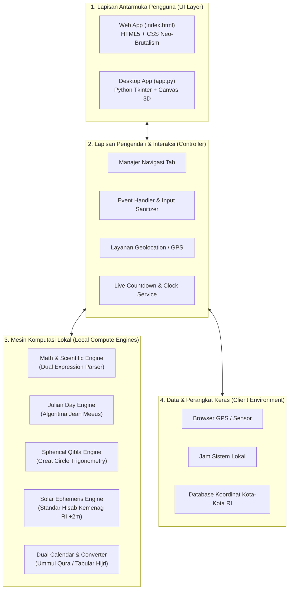
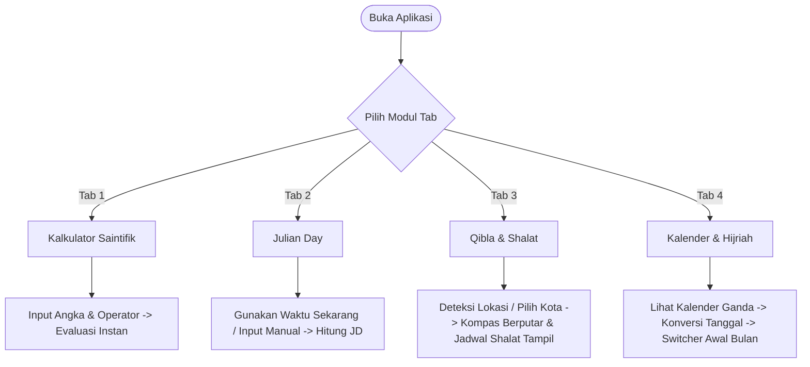
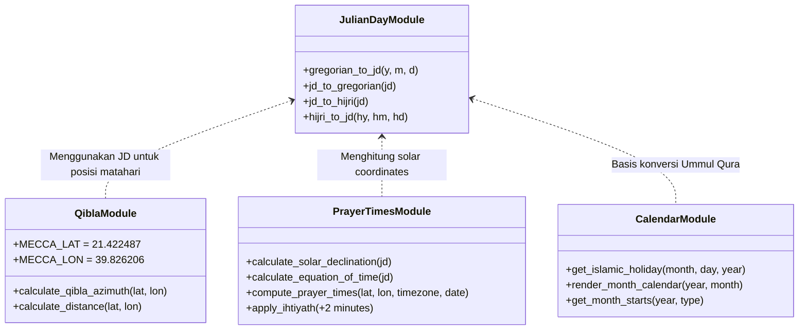

# Desta Calculator - Dokumentasi Sistem & Panduan Klien

> **Versi:** 2.0.0  
> **Lisensi:** MIT  
> **Gaya Desain:** Neo-Brutalism (High Contrast, Bold Borders, Electric Yellow Accent, Zero Emojis)  
> **Platform:** Web Modern (HTML5/CSS3/ES6+) & Desktop GUI (Python 3 / Tkinter)  
> **Sasaran Pembaca:** Klien, Stakeholder Proyek, Pengembang (Developer) & Pengguna Akhir (End User)

---

## 1. Ikhtisar Sistem (Executive Summary)

**Desta Calculator** adalah platform instrumen matematika dan hisab astronomi Islam modern yang dirancang untuk memberikan kemudahan, kecepatan, dan akurasi tinggi bagi pengguna. Aplikasi ini mengintegrasikan empat fungsi penting ke dalam satu antarmuka yang rapi dan elegan:
1. **Kalkulator Saintifik & Aritmatika Presisi**
2. **Kalkulator Hari Julian (*Julian Day*) Astronomis**
3. **Penentu Arah Kiblat Real-Time & Jadwal Shalat Standar Kemenag RI**
4. **Kalender Ganda (Masehi/Hijriah), Konverter Dua Arah & Ringkasan Awal Bulan**

Sistem dibangun dengan arsitektur **Dual-Platform Parity**, yang berarti pengguna mendapatkan fitur, logika hisab, dan ketepatan perhitungan yang sama persis baik saat membuka versi **Web** melalui peramban (tanpa perlu instalasi) maupun saat menggunakan versi **Desktop GUI** berbasis Python.

---

## 2. Penjelasan Arsitektur Sistem (Client-Friendly Architecture)

Arsitektur sistem dirancang dengan prinsip **"Autonomous, Serverless & Client-Side Driven"** — seluruh kecerdasan komputasi diproses langsung di perangkat pengguna (*client device*).

### 2.1 Diagram Arsitektur Tingkat Tinggi (High-Level Architecture)



---

### 2.2 Komponen Arsitektur Utama

1. **Presentation Layer (UI/UX Neo-Brutalism)**:
   - Menggunakan pendekatan desain modern berkarakter kuat: batas garis hitam tebal (*bold black borders* `2px`/`3px`), bayangan kontras tanpa blur (*solid offset shadows*), warna aksen *Electric Yellow* (`#ffde59`), dan tipografi monospaced teknis.
   - Bersifat **Zero-Emoji** — mengutamakan simbol teknis Unicode universal (`◀`, `▶`, `▲`, `▼`, `×`, `÷`, `°`) agar tampilan terlihat profesional, berwibawa, dan tidak kekanak-kanakan.

2. **Autonomous Local Engine (Mesin Hisab Tanpa Server)**:
   - Seluruh rumus trigonometri bola, konversi kalender, dan waktu shalat diprogram langsung di sisi pengguna (JavaScript murni di Web, pustaka `math` standar di Python).
   - Tidak ada panggilan API berbayar ke pihak ketiga untuk menghitung arah kiblat atau waktu shalat, sehingga sistem sangat stabil dan tidak akan pernah mengalami gangguan *"API Down"*.

3. **Data Flow Pipeline (Aliran Data)**:
   ```mermaid
   sequenceDiagram
       autonumber
       actor User as Pengguna / Klien
       participant UI as Antarmuka (Web / Desktop)
       participant Ctrl as Pengendali Event & Validasi
       participant Engine as Mesin Hisab Astronomi
       participant Screen as Layar Tampilan

       User->>UI: Memasukkan data (Koordinat / Tanggal / Angka)
       UI->>Ctrl: Meneruskan input pengguna
       Ctrl->>Engine: Menjalankan algoritma hisab lokal
       Engine-->>Ctrl: Mengembalikan hasil presisi (Arah, Waktu, Tanggal)
       Ctrl->>Screen: Render visual instan (Jarum kompas, Grid, Tabel)
       Screen-->>User: Tampilan terbarui tanpa reload halaman
   ```

---

### 2.3 Nilai Manfaat bagi Klien (Client Benefits)

| Aspek Manfaat | Penjelasan Nyata untuk Klien |
| :--- | :--- |
| **Biaya Operasional Rp 0** | Tidak memerlukan server backend sewa bulanan atau database cloud berbayar. Aplikasi web dapat di-hosting gratis di GitHub Pages, Vercel, Netlify, atau server statis internal. |
| **Kecepatan Instan (<1 ms)** | Perhitungan dilakukan seketika di prosesor perangkat lokal tanpa menunggu transfer data internet (*zero network latency*). |
| **Keamanan & Privasi 100%** | Data koordinat GPS, lokasi rumah/kantor, dan angka perhitungan pengguna tidak pernah dikirim atau disimpan di server eksternal mana pun. |
| **Bisa Bekerja Tanpa Internet (Offline-First)** | Versi desktop dapat berjalan 100% offline di laptop/PC lapangan. Versi web setelah dibuka pertama kali tetap dapat melakukan perhitungan tanpa kuota. |
| **Bebas Kompatibilitas Perangkat** | Versi web responsif otomatis beradaptasi dengan sempurna pada layar HP kecil (320px), tablet, laptop, hingga monitor desktop lebar (Full HD / 4K). |

---

## 3. Alur Penggunaan Sistem (User Journey & Step-by-Step Flow)

Berikut adalah panduan alur kerja (*step-by-step*) interaksi pengguna saat memanfaatkan setiap modul di dalam Desta Calculator:



---

### Alur 1: Menggunakan Kalkulator Saintifik (`CALCULATOR`)
Cocok untuk perhitungan cepat sehari-hari maupun perhitungan teknis ilmiah.

1. **Langkah 1**: Klik tab **"CALCULATOR"**.
2. **Langkah 2**: Klik tombol angka (`0`–`9`) dan tombol operasi (`+`, `-`, `×`, `÷`, `%`, `^`).
3. **Langkah 3 (Fungsi Khusus)**:
   - Gunakan `√` untuk akar kuadrat.
   - Gunakan `sin`, `cos`, `tan` untuk sudut trigonometri.
   - Gunakan `log` (logaritma basis 10) atau `ln` (logaritma natural).
   - Gunakan konstanta `π` ($3.14159...$) atau `e` ($2.71828...$).
4. **Langkah 4**: Tekan tombol `=` (*Electric Yellow*).
   - Hasil kalkulasi langsung ditampilkan dalam angka besar tebal di layar.
   - Layar atas menampilkan riwayat rumus yang baru dihitung.
5. **Langkah 5**: Tekan `C` untuk membersihkan layar, atau `DEL` untuk menghapus satu digit terakhir.

---

### Alur 2: Menghitung Julian Day Astronomis (`JULIAN DAY`)
Digunakan oleh praktisi astronomi, hisab falak, dan sains untuk menentukan posisi benda langit.

1. **Langkah 1**: Klik tab **"JULIAN DAY"**.
2. **Langkah 2 (Pengisian Waktu)**:
   - **Cara Cepat**: Klik tombol **"GUNAKAN WAKTU SEKARANG"**. Sistem otomatis membaca jam komputer/ponsel secara presisi hingga satuan detik.
   - **Cara Manual**: Masukkan tanggal, bulan, tahun, jam, menit, detik, dan zona waktu UTC (misal: `+7` untuk WIB, `+8` untuk WITA, `+9` untuk WIT).
3. **Langkah 3**: Klik tombol **"HITUNG JULIAN DAY"**.
4. **Langkah 4 (Hasil Analisis)**:
   - Kartu hasil menampilkan angka desimal Julian Day (misal `2461311.5`).
   - Disertai informasi hari dalam pekan (Ahad s/d Sabtu) serta nilai astronomis pada tengah hari (*Astronomical Noon Epoch*).

---

### Alur 3: Menentukan Arah Kiblat (Template Statis vs Deteksi GPS Dinamis) & Jadwal Shalat (`QIBLA & SHALAT`)
Pengguna memiliki kebebasan penuh memilih antara **Mode Template (Kompas Statis)** atau **Mode Deteksi GPS (Kompas Dinamis Real-Time)**:

1. **Langkah 1**: Klik tab **"QIBLA & SHALAT"**.
2. **Langkah 2 (Memilih Mode Perhitungan)**:
   - **Mode 1: 📍 LOKASI TEMPLATE (STATIS)**:
     - Pilih nama kota pada menu dropdown (contoh: Jakarta, Surabaya, Bandung, Medan, Makkah, dll) atau masukkan koordinat manual.
     - Klik **"HITUNG QIBLA & SHALAT (STATIS)"**.
     - **Perilaku Kompas**: Kompas berada dalam mode referensi **Utara Sejati statis** (Utara di posisi jam 12, rotasi $0^\circ$). Jarum emas dan ikon Ka'bah menunjukkan sudut arah kiblat statis dari Utara sejati (contoh: `295.14°`). Sensor orientasi tidak aktif sehingga tampilan stabil tanpa terpengaruh pergerakan ponsel.
   - **Mode 2: 🛰️ DETEKSI GPS & SENSOR (LIVE DINAMIS)**:
     - Klik opsi **"2. DETEKSI GPS & SENSOR (LIVE)"** atau tekan tombol **"🛰️ DETEKSI LOKASI SAYA SEKARANG"**.
     - **Kalibrasi Otomatis Instan**: Sistem langsung meminta izin sensor gerak (*DeviceOrientation / Magnetometer API*) dan GPS presisi tinggi secara otomatis tanpa memerlukan penyesuaian derajat manual.
     - **Perilaku Kompas Otomatis**: Piringan kompas (*compass rose*) **berputar secara dinamis dan real-time mengikuti arah hadap fisik perangkat** (dilengkapi kompensasi kemiringan/tilt compensation 3D & orientasi layar).
     - **Retikel Bidik Depan**: Menunjukkan arah hadap perangkat saat ini.
     - **Jarum & Ka'bah 3D**: Terus menunjuk ke arah Ka'bah di dunia nyata secara presisi dengan pergerakan halus (60 FPS damping interpolation).
     - **Umpan Balik Presisi (Alignment Feedback)**:
       - Ketika perangkat berjarak $\le 3^\circ$ dari arah Ka'bah, kompas berpendar hijau zamrud (*Emerald Glow*), menampilkan banner *"✓ ANDA TEPAT MENGHADAP KIBLAT!"*, dan memicu getaran haptik (*Haptic Vibration*).
       - Jika belum tepat, HUD memandu belokan: *"⟳ PUTAR KE KANAN X°"* atau *"⟲ PUTAR KE KIRI X°"*.
       - Jika terdeteksi gangguan magnetik atau diperlukan kalibrasi, sistem memandu kalibrasi pola angka 8 (*figure-8 calibration*).
       - Pada pengujian di PC/laptop tanpa sensor magnetik fisik, sistem otomatis mendeteksi perangkat desktop dan menampilkan arah kiblat statis yang akurat berdasarkan posisi GPS Anda.
3. **Langkah 3 (Melihat Jadwal Shalat)**:
   - 7 kartu waktu shalat ditampilkan lengkap: **Imsak, Subuh, Terbit, Dzuhur, Ashar, Maghrib, dan Isya**.
   - Shalat yang sedang berlangsung otomatis disorot dengan warna kuning terang (*Active Prayer Card*).
   - Jam hitung mundur (*Live Countdown*) menampilkan sisa waktu detik-demi-detik menuju shalat berikutnya.

---

### Alur 4: Kalender Ganda, Konversi Tanggal & Awal Bulan (`KALENDER & HIJRIAH`)
Pusat sinkronisasi antara kalender Masehi internasional dan kalender Hijriah Islam.

1. **Langkah 1**: Klik tab **"KALENDER & HIJRIAH"**.
2. **Langkah 2 (Eksplorasi Kalender Bulanan)**:
   - Kalender menampilkan 7 kolom hari dengan penanggalan ganda: angka besar untuk Masehi, dan lencana hitam untuk tanggal Hijriah.
   - Hari ini disorot otomatis dengan warna kuning.
   - Tanggal puasa sunnah bulanan (*Puasa Ayyamul Bidh* pada tanggal 13, 14, 15 Hijriah) serta hari raya Islam otomatis memiliki tanda khusus.
   - Gunakan tombol `◀ BULAN LALU`, `HARI INI`, dan `BULAN DEPAN ▶` untuk berpindah bulan, atau pilih langsung bulan & tahun pada kotak pilihan cepat.
   - **Klik sel tanggal mana saja**: Kotak info di bawah kalender seketika memperlihatkan rincian hari, tanggal Masehi lengkap, tanggal Hijriah lengkap, dan peringatan/event pada hari tersebut.
3. **Langkah 3 (Konversi Tanggal)**:
   - **Masehi ➔ Hijriah**: Pilih tanggal pada kalender Masehi lalu klik *"KONVERSI KE HIJRIAH"*.
   - **Hijriah ➔ Masehi**: Masukkan tanggal (1–30), pilih nama bulan Hijriah dari daftar, masukkan tahun, lalu klik *"KONVERSI KE MASEHI"*.
4. **Langkah 4 (Informasi Awal Bulan dengan Pengalih / Switcher Ringkas)**:
   - Untuk menghemat ruang layar dan tidak membuat halaman terlalu panjang, disediakan panel terpadu dengan 2 tombol pengalih:
     - Klik **"AWAL BULAN HIJRIAH DI MASEHI"**: Menampilkan daftar tanggal 1 untuk seluruh 12 bulan Hijriah pada tahun Hijriah yang dipilih (misal tahun 1448 H), lengkap dengan hari dan padanan tanggal Masehinya.
     - Klik **"AWAL BULAN MASEHI DI HIJRIAH"**: Menampilkan daftar tanggal 1 untuk seluruh 12 bulan Masehi pada tahun Masehi yang dipilih (misal tahun 2026 M), lengkap dengan hari dan padanan tanggal Hijriahnya.
   - Tombol `◀ TAHUN LALU` dan `TAHUN DEPAN ▶` memungkinkan penelusuran tahun lalu dan tahun mendatang secara instan.

---

## 4. Struktur Direktori Proyek

```
kalkulator-desta/
│
├── index.html               # File Web Tunggal: Struktur HTML5, Desain Sistem CSS, & Engine JS
├── app.py                   # File Desktop GUI: Logika Python 3, Antarmuka Tkinter, & Canvas Vektor
├── test.py                  # Script Pengujian & Verifikasi Fungsi Matematika/Astronomi
└── SYSTEM_DOCUMENTATION.md  # Dokumentasi Teknis Sistem & Panduan Klien (File ini)
```

---

## 5. Ringkasan Formula Matematika & Standar Astronomi



1. **Arah Kiblat (Trigonometri Bola)**:
   $$\tan Q = \frac{\sin(\lambda_m - \lambda)}{\cos \phi \tan \phi_m - \sin \phi \cos(\lambda_m - \lambda)}$$
   - $\phi$: Lintang pengamat, $\lambda$: Bujur pengamat.
   - $\phi_m$: Lintang Ka'bah ($21.422487^\circ$), $\lambda_m$: Bujur Ka'bah ($39.826206^\circ$).

2. **Waktu Shalat (Kementerian Agama RI)**:
   - Sudut Subuh: $-20^\circ$ di bawah ufuk timur.
   - Sudut Isya: $-18^\circ$ di bawah ufuk barat.
   - Sudut Terbit & Maghrib: Piringan atas matahari menyentuh ufuk ($\text{zenith } 90.833^\circ$).
   - Dzuhur: Waktu transit matahari lokal $+ 2$ menit ihtiyath.
   - Ashar: Bayangan objek = panjang bayangan zawal + tinggi objek.
   - Imsak: Waktu Subuh $- 10$ menit (dengan pengaman ihtiyath $+2$ menit).

3. **Konversi Kalender Masehi ⇄ Hijriah**:
   - Berbasis penanggalan siklus astronomis Julian Day dan hisab kalender Ummul Qura.
   - Memperhitungkan panjang bulan 29 dan 30 hari secara dinamis.

---

## 6. Desain Sistem Neo-Brutalism & Pencegahan Layout Offside

Aplikasi mengimplementasikan panduan visual Neo-Brutalism berstandar industri dengan proteksi tata letak:

1. **Sistem Warna & Border**:
   - Border Solid Black `2px` s/d `3px` (`#000000`) pada seluruh elemen input dan tombol.
   - Aksen utama warna kuning elektrik (*Electric Yellow* `#ffde59`).
   - Warna latar bertekstur dot matrix modern (`radial-gradient(#000 1px, transparent 1px)`).
2. **Pencegahan CSS Offside (Solusi Bug Layout)**:
   - **Strict Grid Containment**: Menggunakan `grid-template-columns: minmax(0, 1fr) minmax(0, 1fr)` dan batasan `min-width: 0` pada kartu agar tabel tidak pernah meluber melebihi lebar layar.
   - **Flush Shadows**: Menghilangkan shadow eksternal berlebih pada kartu yang berada di dalam kontainer bergaris agar tepi kartu sejajar presisi (*pixel-perfect alignment*).
   - **Mobile-Adaptive Calendar Cells**: Pada layar ponsel ($\le 540\text{px}$), angka tanggal Masehi dan lencana Hijriah otomatis ditata vertikal bertumpuk di tengah sel, menjamin keterbacaan tinggi tanpa terpotong.
3. **Penghematan Ruang Vertikal**:
   - Penggabungan tabel awal bulan menjadi satu kartu bersistem pengalih (*toggle switcher*) memotong tinggi halaman hingga 50%, membuat navigasi jauh lebih ringkas dan nyaman bagi klien.

---

## 7. Panduan Menjalankan Sistem

### Menjalankan Versi Web (Rekomendasi untuk Klien)
Tidak membutuhkan instalasi software tambahan, node_modules, maupun konfigurasi server.
1. Cukup klik ganda file [`index.html`](file:///d:/desta%20part%202/kalkulator-desta/index.html) untuk langsung membukanya di browser Google Chrome, Microsoft Edge, Firefox, atau Safari.
2. Untuk menjalankan via server lokal pengembang:
   ```bash
   python -m http.server 8000
   ```
   Akses melalui browser di alamat: `http://localhost:8000`.

### Menjalankan Versi Desktop (Python GUI)
1. Pastikan komputer memiliki Python versi 3.10 ke atas.
2. Buka terminal pada folder proyek, lalu jalankan:
   ```bash
   python app.py
   ```
3. Jendela aplikasi desktop Desta Calculator akan langsung terbuka secara mandiri.

---

## 8. Kesimpulan & Penutup

Arsitektur **Desta Calculator** membuktikan bahwa aplikasi matematika dan hisab astronomi yang kompleks dapat dikemas secara elegan, ringan, dan mandiri tanpa membebani klien dengan biaya server maupun infrastruktur yang rumit. Desain Neo-Brutalism yang diterapkan memberikan karakter visual yang unik, modern, dan sangat fungsional di berbagai ukuran layar.
